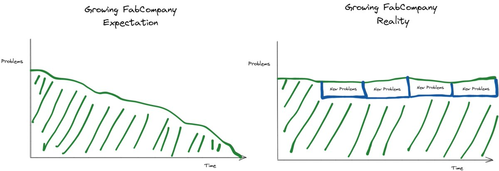
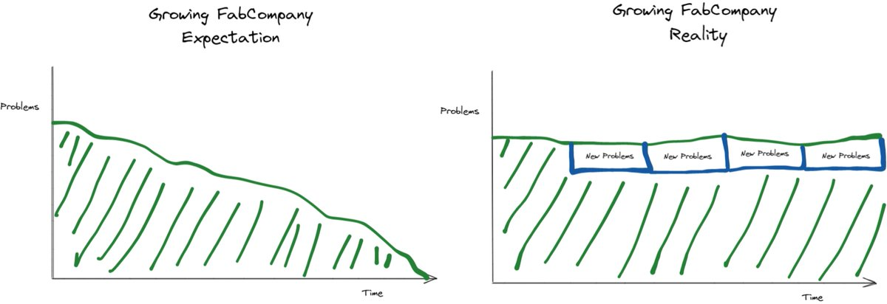

# Chapter 1: Problem upgrade chart [Read on Twitter](https://twitter.com/jmwind/status/1460284795150225409)

This is the most common question I'm answering in recent fireside chats...

Q. How do you handle/manage the stress of working in a hyper-growth company where there's always too much to do?"

A. It's a mindset change: problems upgrade but don't go away. Let me explain... 🧵

The reason this problem mindset is hard to develop is our human bias that gets in the way... From childhood we are trained to see work equate with problems diminishing over time. You finish your assignment, and it's done. You complete your courses, you finish a sports game.

The Agile development process is the worst for this as the coveted "burn down" chart is what you use to see if you're doing a good job as a team. You equate progress with "less story points". You measure your self-worth with problems going away.

But in high growth companies, problems never go away. If every year you have 100 problems in your company. With the product, people, processes... what ever... every single year you will still have 100 problems. EVERY YEAR... 100 problems. Most aren't going away. And those that are fixed are replaced immediately. 

[If problems never go away, you have to measure progress differently. It will require building an entire new mental model for progress. Throw out burn down charts completely. This sounds simple, but it's the number one reason why most people can't handle hyper growth.

Say hello to the "problem upgrade chart". Burn this into your mind. It will save you.

Yearly progress is when 5-15% of your problems are new.  And not that they all go away. Remember, you will always have 100 problems.

Why will this save you? Because your entire self-worth is based on a bad mental model. If you can start seeing problem upgrades vs problem disappearing you will learn to see progress.

And progress is the fuel for our work.

The hard part is that you can't log into JIRA and see a problem upgrade chart. So you have to build some ways to see your company with this lens without a tool. 

Write down a problem list at the start of the year, things that really piss you off.

[Tweet link](https://twitter.com/jmwind/status/1460284806902726658)

---

Jean-Michel Lemieux ([@jmwind](https://twitter.com/jmwind))

9/ Every year review that list and if you can cross out 10-15% of the items, you're killing it! Pop open the champagne, have a progress dance, and be super happy!

[Tweet link](https://twitter.com/jmwind/status/1460284808010084352)

---

Jean-Michel Lemieux ([@jmwind](https://twitter.com/jmwind))

10/ Then start sharing this mindset with your colleagues. 

There are a lot of people around you who are devout pessimists that will drag you down. It's really hard to stay positive in a sea of burndown zealots. 

But keep pushing. You've got this!

[Tweet link](https://twitter.com/jmwind/status/1460284809201213441)

---

Jean-Michel Lemieux ([@jmwind](https://twitter.com/jmwind))

11/ It's an absolute honour being in a growing company. 

The problem upgrade chart &amp; mindset will make it fun in addition to being an honour. 

This has been my secret to not burning out over 26 years in high growth teams/companies. 

Happy company building to all! [pic.twitter.com/VeUPT3v2LO](https://twitter.com/jmwind/status/1460284813101969419/photo/1)

[Tweet link](https://twitter.com/jmwind/status/1460284813101969419)