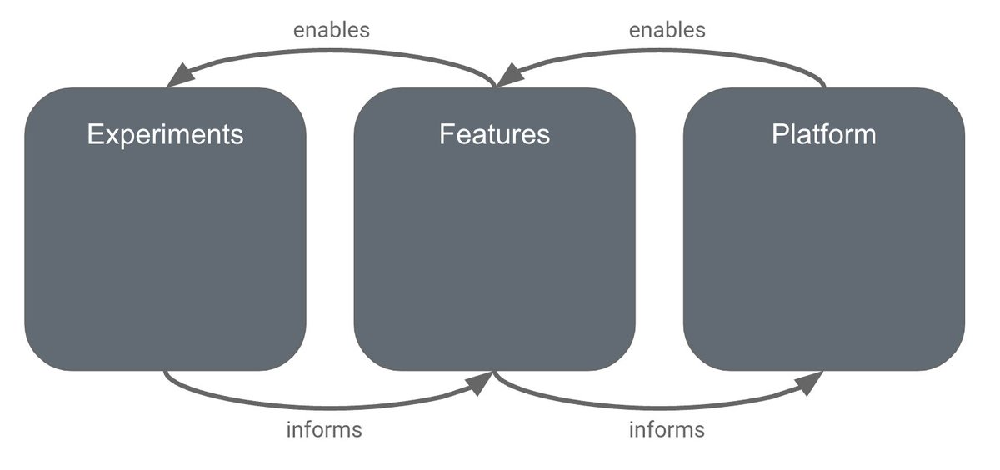

Another common question I’m answering working with scaling tech companies is…

Q. How much of your r&amp;d spend should be focused on platform work? 

A. 50%, and most teams are way off what it should be. Let me explain…🧵 (1/21)

[Tweet link](https://twitter.com/jmwind/status/1470894712538103813)

---

Jean-Michel Lemieux ([@jmwind](https://twitter.com/jmwind))

2/ This question is a proxy question for many underlying issues…

✳️ Lack of trust in the engineering team

✳️ Lack of understand of your strategy

✳️ Lack of long term thinking and culture

✳️ Lack of understanding of compounding technology investments

[Tweet link](https://twitter.com/jmwind/status/1470894713624358913)

---

Jean-Michel Lemieux ([@jmwind](https://twitter.com/jmwind))

3/ This comes up is often in panic situations, “the engineering team says that there’s too much technical debt and can’t work on features”… but the problems started way before.

[Tweet link](https://twitter.com/jmwind/status/1470894714710679555)

---

Jean-Michel Lemieux ([@jmwind](https://twitter.com/jmwind))

4/ Let’s step back… what is meant by platform? Its definition has changed over the decades and we can’t talk about platform investments without a shared definition.

[Tweet link](https://twitter.com/jmwind/status/1470894715792809984)

---

Jean-Michel Lemieux ([@jmwind](https://twitter.com/jmwind))

5/ Platform used to mean a complete software development environment and underlying subsystem with language, runtime, components and all associated libraries and binaries. 

Only the big guys had one, Windows, iOS, Linux, Eclipse – 

and then platforms became mainstream.

[Tweet link](https://twitter.com/jmwind/status/1470894716786905092)

---

Jean-Michel Lemieux ([@jmwind](https://twitter.com/jmwind))

6/ In the recent decade, a platform is more broad and means anything that you can build upon. 

A platform enables you to build things with that were not originally envisaged. 

A platform is the foundational layers of your product. 

Every company in the 1-N phase has one.

[Tweet link](https://twitter.com/jmwind/status/1470894717839704067)

---

Jean-Michel Lemieux ([@jmwind](https://twitter.com/jmwind))

7/ More concretely your platform is a lot:

✳️ Infra that runs your stuff

✳️ Development environment and tools that helps write / test / run code

✳️ System architecture / security

✳️ Key technology choices

✳️ Core abstractions (data model, business modelling)

✳️ API/SDKs

[Tweet link](https://twitter.com/jmwind/status/1470894718867238917)

---

Jean-Michel Lemieux ([@jmwind](https://twitter.com/jmwind))

8/ Your platform isn’t just the small set of hidden engineering parts. 

The quality of your platform investments will influence some of your most important product features: scalability, speed, quality, flexibility. 

🙌🏽 It's the most important product features you have.

[Tweet link](https://twitter.com/jmwind/status/1470894719962005508)

---

Jean-Michel Lemieux ([@jmwind](https://twitter.com/jmwind))

9/ Platform work is also the most important retention tool for your engineers. 

Give them the tools and architecture to be productive. 

👉🏼 And if you don't, they will leave to a team that will.

[Tweet link](https://twitter.com/jmwind/status/1470894721077633024)

---

Jean-Michel Lemieux ([@jmwind](https://twitter.com/jmwind))

10/ A way of visualizing your r&amp;d investments is with 3 buckets. Having the right mix is critical. They work together. 

A healthy investment distribution is 50% platform, 40% features, and 10% experiments.

You can skew for short periods, but over the long term its fatal. [pic.twitter.com/nCMDAGDyYT](https://twitter.com/jmwind/status/1470894726555389958/photo/1)

[Tweet link](https://twitter.com/jmwind/status/1470894726555389958)

---

Jean-Michel Lemieux ([@jmwind](https://twitter.com/jmwind))

11/ The feedback loop between investment types is critical. 

Feature and experiments inform your platform roadmap, and inversely platform provides leverage to build more features/experiments. 

If not balanced, you loose these feedback loops. And the feedback loops guide you.

[Tweet link](https://twitter.com/jmwind/status/1470894728082116609)

---

Jean-Michel Lemieux ([@jmwind](https://twitter.com/jmwind))

12/ Platform work isn't all roses. 

You can burn A TON of money with wasted platform work. 

It’s a huge trap and the larger a company gets the more of a trap it becomes.

[Tweet link](https://twitter.com/jmwind/status/1470894729193689090)

---

Jean-Michel Lemieux ([@jmwind](https://twitter.com/jmwind))

13/ Golden Rule of platforms...platforms are extracted from product / feature / experiences. 

You can’t build platform hoping “they will come”. 

Break this rule and you’ll waste millions in APIs that no one needs or uses. 

⭐️ Duplication is better than the wrong abstraction

[Tweet link](https://twitter.com/jmwind/status/1470894730246451201)

---

Jean-Michel Lemieux ([@jmwind](https://twitter.com/jmwind))

14/ The most common platform debt domain are data models that become bloated and hard for devs to grok. God objects, mutations and side effects everywhere. 

Keep your domain model up to date with your current understanding of the domain. Not that of your past understanding.

[Tweet link](https://twitter.com/jmwind/status/1470894731341168641)

---

Jean-Michel Lemieux ([@jmwind](https://twitter.com/jmwind))

15/ The other common low investment is in test suites and automation around development env setup. 

I've met teams where it takes 2 days to setup a basic dev env. 

Not a joke. This is a tax on every developer you've hired (oh, did I say that they will leave because of this).

[Tweet link](https://twitter.com/jmwind/status/1470894732372942851)

---

Jean-Michel Lemieux ([@jmwind](https://twitter.com/jmwind))

16/ Because your platform supports your most important product features you need data about them. 

Your CFO will publish detailed financials, you have to track detailed data about speed, scale, uptime

...most engineering teams don't track as well as your finance team does.

[Tweet link](https://twitter.com/jmwind/status/1470894733446631425)

---

Jean-Michel Lemieux ([@jmwind](https://twitter.com/jmwind))

17/ Platform work has longer timelines. It's longer to build a subway, then to add a new floor on an existing building. 

Make sure you celebrate platform work in progress 🎉. 

Have milestones (ideally in prod), don't wait for it to ship fully. Build endurance for longer work...

[Tweet link](https://twitter.com/jmwind/status/1470894734499401729)

---

Jean-Michel Lemieux ([@jmwind](https://twitter.com/jmwind))

18/ Unfortunately, many companies celebrate features more than they do platform. 

Most PMs will be closer to the features and are generally more outgoing! The engineers are heads-down just trying to make things work :) Work with your PMs so that they see the platform work.

[Tweet link](https://twitter.com/jmwind/status/1470894735581581312)

---

Jean-Michel Lemieux ([@jmwind](https://twitter.com/jmwind))

19/ Platform work has an interesting attribute in that the side effects of low investment mean you'll get slower slowly. 

It doesn't happen over night. 

So you can ignore it for a bit. Then a bit more..and... bam💥. You're asking, why do I have to invest in platform work again?

[Tweet link](https://twitter.com/jmwind/status/1470894736651083777)

---

Jean-Michel Lemieux ([@jmwind](https://twitter.com/jmwind))

20/ Building software is hard, there's no silver bullet. 

But have a strategy around what you're building and what role it plays short and long term. 

Build a tech investment system that reinforces itself. 

That's why I suggest you spend 50% of your r&amp;d budget on your platform [pic.twitter.com/7eFACgJrwA](https://twitter.com/jmwind/status/1470894740505722880/photo/1)

[Tweet link](https://twitter.com/jmwind/status/1470894740505722880)

---

Jean-Michel Lemieux ([@jmwind](https://twitter.com/jmwind))

21/ ... would love to hear what you think? What mental models do you use to help guide where you spend your engineering time? What did I miss?

[Tweet link](https://twitter.com/jmwind/status/1470894742011453444)