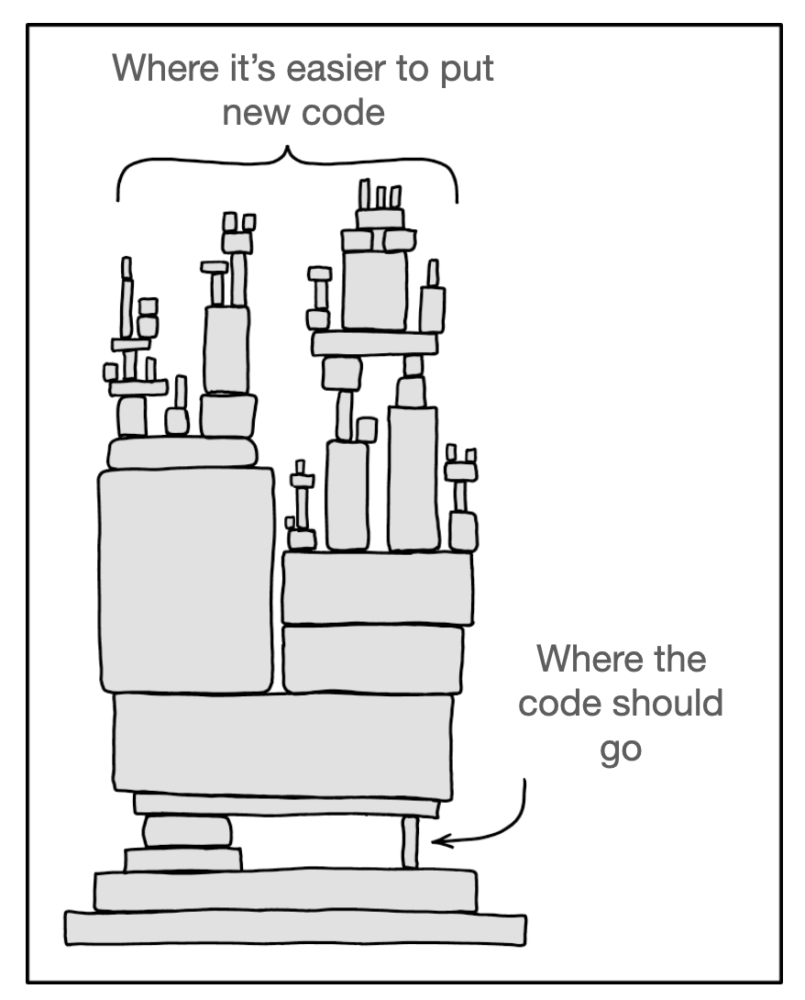
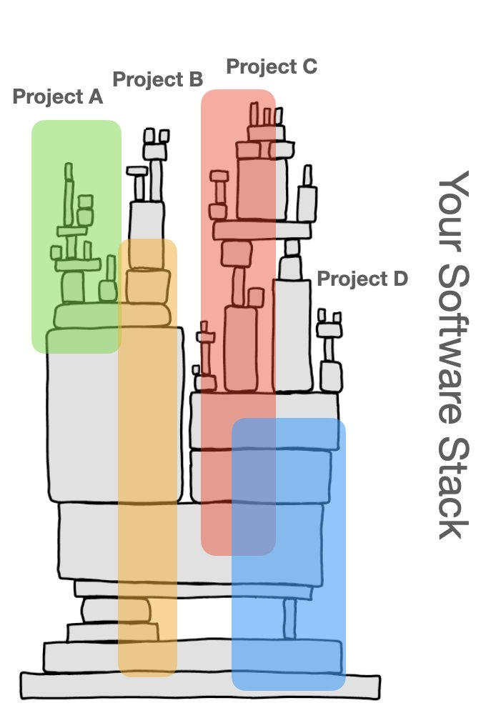
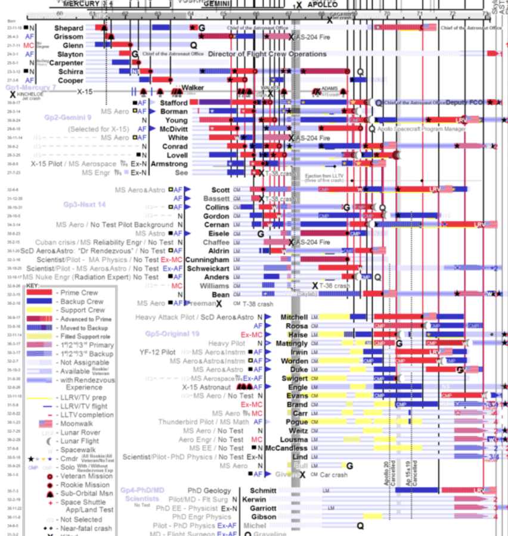
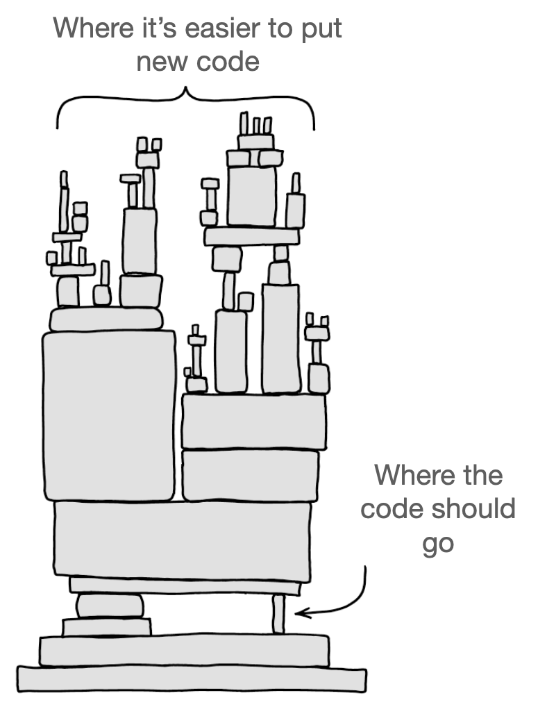

Another common question I’m answering working with scaling tech companies is…

Q. What virus infects growing engineering orgs the most?

A. Layerinitis. Let me explain... 🧵 (1/27) [pic.twitter.com/uiLQCrjhLb](https://twitter.com/jmwind/status/1477399261700526080/photo/1)

[Tweet link](https://twitter.com/jmwind/status/1477399261700526080)

TODO: attribution for picture to xcde

---

Jean-Michel Lemieux ([@jmwind](https://twitter.com/jmwind))

2/ As your eng org grows you have to organize into teams. Companies start with shared ownership of the code base and small project teams that form and disband. It's a good model, but past 50+ engineers that falls apart...

[Tweet link](https://twitter.com/jmwind/status/1477399263436939268)

---

Jean-Michel Lemieux ([@jmwind](https://twitter.com/jmwind))

3/ In 2015 at Shopify there was a busy file called api_client.rb. I spoke to the last 20 committers. Everyone was adding new attributes, but when asked why the answer was "I was just following what the previous committer did" an "had a deadline".

[Tweet link](https://twitter.com/jmwind/status/1477399264661671938)

---

Jean-Michel Lemieux ([@jmwind](https://twitter.com/jmwind))

4/ The design philosophy of that entire area of Shopify was shared across everyone. But there was no real owner or steward. As they say... the fastest way to starve a horse is to ask two people to feed it.

[Tweet link](https://twitter.com/jmwind/status/1477399265752190977)

---

Jean-Michel Lemieux ([@jmwind](https://twitter.com/jmwind))

5/ So as you'd expect, as your org grows, you create teams that have stewardship for areas of your product. 

There's a lot of research that shows that code ownership increases the quality of software. [microsoft.com/en-us/research…](https://www.microsoft.com/en-us/research/publication/code-ownership-and-software-quality-a-replication-study/)

[Tweet link](https://twitter.com/jmwind/status/1477399266767167488)

---

Jean-Michel Lemieux ([@jmwind](https://twitter.com/jmwind))

6/ At this point you think you've got everything figured out. You define boundaries in your software, modularity is good. You can reduce dependencies with good APIs, DDD, and increase the overall quality all at once. You're winning! That was easy... right?

[Tweet link](https://twitter.com/jmwind/status/1477399267950022657)

---

Jean-Michel Lemieux ([@jmwind](https://twitter.com/jmwind))

7/ We modularized somewhat retroactively at Shopify (read about it [shopify.engineering/deconstructing…](https://shopify.engineering/deconstructing-monolith-designing-software-maximizes-developer-productivity)) and we started with a modular architecture at [Eclipse.org](http://Eclipse.org) in 2000.

[Tweet link](https://twitter.com/jmwind/status/1477399269082497024)

---

Jean-Michel Lemieux ([@jmwind](https://twitter.com/jmwind))

8/ But what you didn't realize is that layerinitis has been lurking just waiting to attack your org. It's triggered right at that moment when you think you have the perfect architecture and team structure. And it hits hard.

[Tweet link](https://twitter.com/jmwind/status/1477399270244294656)

---

Jean-Michel Lemieux ([@jmwind](https://twitter.com/jmwind))

9/ You also likely have PMs matched up to each team and you want them to be as independent as possible. You want to stay fast and nimble and your incentives are aligned for that (promotions, raises)...

[Tweet link](https://twitter.com/jmwind/status/1477399271397756928)

---

Jean-Michel Lemieux ([@jmwind](https://twitter.com/jmwind))

10/ Then you realize that 80% of the projects that introduce new features or capabilities look like this: [pic.twitter.com/AeIbI6vOBT](https://twitter.com/jmwind/status/1477399275050967042/photo/1)

[Tweet link](https://twitter.com/jmwind/status/1477399275050967042)

---

Jean-Michel Lemieux ([@jmwind](https://twitter.com/jmwind))

11/ But the code is always added at the top of your stack. This is a very human response by teams, you have incentives aligned to ship fast at the teams level and it's much easier to measure that vs if the code in the right spot for the long term health of your system.

[Tweet link](https://twitter.com/jmwind/status/1477399276384751616)

---

Jean-Michel Lemieux ([@jmwind](https://twitter.com/jmwind))

12/ The technical definition for layerinitis is teams putting code where they are most comfortable while optimizing for speed vs putting the code where it belongs when considering a longer term perspective on the overall software system.

[Tweet link](https://twitter.com/jmwind/status/1477399277408194563)

---

Jean-Michel Lemieux ([@jmwind](https://twitter.com/jmwind))

13/ It's very easy to diagnose, so that's great news. Ask teams where the code should go for their project if they break down the capabilities they are introducing with their project into the model introduced here: [twitter.com/jmwind/status/…](https://twitter.com/jmwind/status/1470894712538103813?s=20)

[Tweet link](https://twitter.com/jmwind/status/1477399278519668737)

---

Jean-Michel Lemieux ([@jmwind](https://twitter.com/jmwind))

14/ Let's pause a second. Layerinitis isn't bad, it's a virus that every org will get. We've all been there. But there are cultural, process, and tooling tricks you can implement that will prevent layerinitis from crippling your teams.

[Tweet link](https://twitter.com/jmwind/status/1477399279731838978)

---

Jean-Michel Lemieux ([@jmwind](https://twitter.com/jmwind))

15/ Starting with culture, ask yourself, do teams have permission to learn and build confidence with different parts of your software stack?

[Tweet link](https://twitter.com/jmwind/status/1477399280851644418)

---

Jean-Michel Lemieux ([@jmwind](https://twitter.com/jmwind))

16/ One memorable experience at Shopify was when we tried to add subscriptions to the platform for 2 years. The team who owned the featured owned the UI parts of the online store. So every solution ended up a very UI focused solution.

[Tweet link](https://twitter.com/jmwind/status/1477399281896067073)

---

Jean-Michel Lemieux ([@jmwind](https://twitter.com/jmwind))

17/ I took the team into a boardroom, they were all extremely smart engineers. They were stressed. I changed the goals of the project: 1) your mission is to find the best place to build subscriptions into Shopify 2) build a prototype / fork any repo and we will throw it away.

[Tweet link](https://twitter.com/jmwind/status/1477399282940452868)

---

Jean-Michel Lemieux ([@jmwind](https://twitter.com/jmwind))

18/ A big lesson from this is that the team had the skill to do the work, but never had permission to deeply build confidence in other areas of the code base. They didn't see their role as stewards of the overall architecture of Shopify vs shipping the feature.

[Tweet link](https://twitter.com/jmwind/status/1477399284047695872)

---

Jean-Michel Lemieux ([@jmwind](https://twitter.com/jmwind))

19/ We often forget that prototyping isn't just about finding a good architecture or figuring out how long something will take to build. One of the most important benefits of prototypes is increasing the confidence in your engineering teams to work and understand layers.

[Tweet link](https://twitter.com/jmwind/status/1477399285217914880)

---

Jean-Michel Lemieux ([@jmwind](https://twitter.com/jmwind))

20/ I've seen so many teams that replace prototypes with roadmaps. Then they stop building to learn. And now they have roadmaps with no substance. It's a vicious circle.

[Tweet link](https://twitter.com/jmwind/status/1477399286304296960)

---

Jean-Michel Lemieux ([@jmwind](https://twitter.com/jmwind))

21/ There's another big side effect of using prototypes as a way to dampen layerinitis. Often the prototype team end of digging into platform / infra level areas that are often owned by small teams. Those teams really appreciate having more people learn about their areas...

[Tweet link](https://twitter.com/jmwind/status/1477399287399006208)

---

Jean-Michel Lemieux ([@jmwind](https://twitter.com/jmwind))

22/ ...over time I've seen a healthy growth of morale and committers across different layers just by encouraging more cross-layer prototype at the start of large projects. And that builds more long term resiliency of knowledge across your teams.

[Tweet link](https://twitter.com/jmwind/status/1477399288460156931)

---

Jean-Michel Lemieux ([@jmwind](https://twitter.com/jmwind))

23/ Once you have a few good cultural habits, the next change that helps is a process one. Ensure you have enough flexibility in your roadmaps to put people from across different layers of your stack onto the projects that need them...

[Tweet link](https://twitter.com/jmwind/status/1477399289596764168)

---

Jean-Michel Lemieux ([@jmwind](https://twitter.com/jmwind))

24/ ...this may sound trivial, but every company has an army of people managing crazy gantt charts that will explode when re-jiggle people. But do it anyway. 

You had one job as a manager... put the right skills on the right projects. Period. [pic.twitter.com/vahSDuDzWw](https://twitter.com/jmwind/status/1477399294562820096/photo/1)

[Tweet link](https://twitter.com/jmwind/status/1477399294562820096)

---

Jean-Michel Lemieux ([@jmwind](https://twitter.com/jmwind))

25/ The next layerinitis defence is standardizing access and setup of any code base in your company. You should have the same command to setup a dev environment, test, tools for every code base.

[Tweet link](https://twitter.com/jmwind/status/1477399296311844865)

---

Jean-Michel Lemieux ([@jmwind](https://twitter.com/jmwind))

26/ You need amazing READMEs that assume that those reading are new and want to learn how to contribute vs just use. Again, sounds trivial but some many teams have crappy READMEs that make it hard and intimidating to setup and contribute.

[Tweet link](https://twitter.com/jmwind/status/1477399297381392384)

---

Jean-Michel Lemieux ([@jmwind](https://twitter.com/jmwind))

27/ That's the short summary of why I think that layerinitis is the worst virus that will eventually infect your engineering org and the defences you can start to build now. [pic.twitter.com/pDVqlUokCj](https://twitter.com/jmwind/status/1477399300850159616/photo/1)

[Tweet link](https://twitter.com/jmwind/status/1477399300850159616)